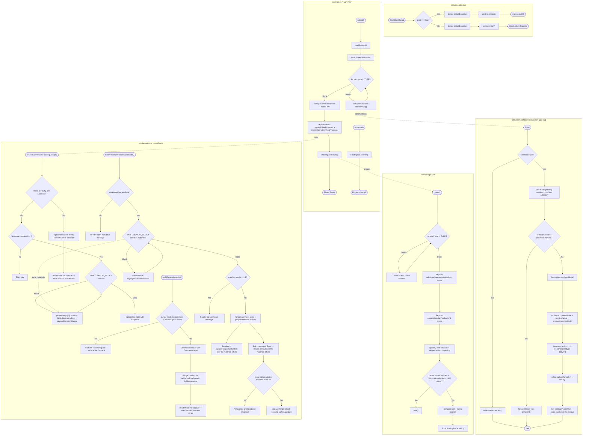
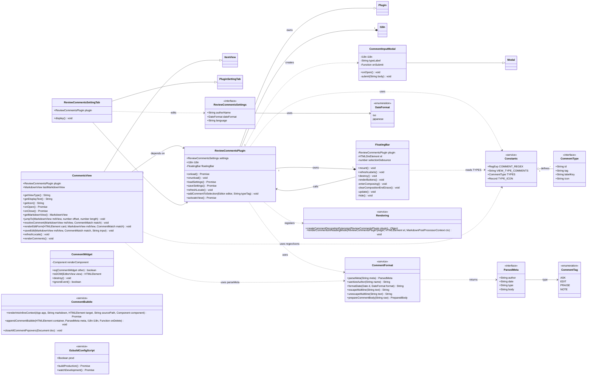

## Diagrams

## Flow diagram

```mermaid
flowchart TD
    %% Build pipeline
    subgraph SG1["esbuild.config.mjs"]
        B1(["Start Build Script"]) --> B2{"prod === true?"}
        B2 -->|Yes| B3["Create esbuild context"]
        B3 --> B4["context.rebuild()"]
        B4 --> B5(["process.exit(0)"])
        B2 -->|No| B6["Create esbuild context"]
        B6 --> B7["context.watch()"]
        B7 --> B8(["Watch Mode Running"])
    end

    %% Plugin lifecycle
    subgraph SG2["src/main.ts Plugin Flow"]
        M1(["onload()"]) --> M2["loadSettings()"]
        M2 --> M3["init I18n(resolveLocale)"]
        M3 --> M4{"for each type in TYPES"}
        M4 -->|Iterate| M5["addCommand(add-comment-{id})"]
        M5 --> M4
        M4 -->|Done| M6["add open panel command + ribbon icon"]
        M6 --> M7["registerView + registerEditorExtension + registerMarkdownPostProcessor"]
        M7 --> M8["FloatingBar.mount()"]
        M8 --> M9(["Plugin Ready"])

        U1(["onunload()"]) --> U3["FloatingBar.destroy()"]
        U3 --> U4(["Plugin Unloaded"])
    end

    %% Add comment control flow
    subgraph SG3["addCommentToSelection(editor, typeTag)"]
        C1(["Entry"]) --> C2{"selection exists?"}
        C2 -->|No| C3["Notice(select text first)"]
        C3 --> C4(["Exit"])
        C2 -->|Yes| C4b["Trim leading/trailing newlines out of the selection"]
        C4b --> C5{"selection contains comment markers?"}
        C5 -->|Yes| C6["Notice(already has comment)"]
        C6 --> C4
        C5 -->|No| C7["Open CommentInputModal"]
        C7 --> C8["onSubmit -> formatDate + sanitizeAuthor + prepareCommentBody"]
        C8 --> C9["Wrap text as {==...==}{>>author|date|type: body<<}"]
        C9 --> C10["editor.replaceRange(...) + focus()"]
        C10 --> C11["Set pendingPulseOffset + place caret after the markup"]
        C11 --> C4
    end

    %% Floating bar behavior
    subgraph SG4["src/floating-bar.ts"]
        F1(["mount()"]) --> F2{"for each type in TYPES"}
        F2 -->|Iterate| F3["Create button + click handler"]
        F3 --> F2
        F2 -->|Done| F4["Register selectionchange/scroll/keydown events"]
        F4 --> F4b["Register compositionstart/update/end events"]
        F4b --> F5["update() with debounce, skipped while composing"]

        F5 --> F6{"active MarkdownView + non-empty selection + valid range?"}
        F6 -->|No| F7["hide()"]
        F6 -->|Yes| F8["Compute rect + clamp position"]
        F8 --> F9["Show floating bar at left/top"]
    end

    %% Rendering and panel flow
    subgraph SG5["src/rendering.ts + src/view.ts"]
        R1(["renderCommentsInReadingMode(el)"]) --> R1b{"Block is exactly one comment?"}
        R1b -->|Yes| R1c["Replace block with review-comment-block + bubble"]
        R1b -->|No| R2{"Text node contains {== ?"}
        R2 -->|No| R3["Skip node"]
        R2 -->|Yes| R4{"while COMMENT_REGEX matches"}
        R4 -->|Match| R5["parseMeta(m[2]) + render highlighted markdown + appendCommentBubble"]
        R5 --> R4
        R4 -->|Done| R6["replace text node with fragment"]
        R1c --> R7["Delete from the popover -> Vault.process over the file"]

        W1(["buildDecorations(view)"]) --> W2{"cursor inside the comment or markup spans lines?"}
        W2 -->|Yes| W3["Mark the raw markup so it can be edited in place"]
        W2 -->|No| W4["Decoration.replace with CommentWidget"]
        W4 --> W5["Widget renders the highlighted markdown + bubble popover"]
        W5 --> W6["Delete from the popover -> view.dispatch over the range"]

        V1(["CommentsView.renderComments()"]) --> V2{"MarkdownView available?"}
        V2 -->|No| V3["Render open-markdown message"]
        V2 -->|Yes| V4{"while COMMENT_REGEX matches editor text"}
        V4 -->|Match| V5["Collect match: highlighted/meta/offset/full"]
        V5 --> V4
        V4 -->|Done| V6{"matches.length === 0?"}
        V6 -->|Yes| V7["Render no-comments message"]
        V6 -->|No| V8["Render comment cards + jump/edit/resolve actions"]
        V8 --> V9["Resolve -> replaceRange(highlighted) over the matched offsets"]
        V8 --> V10["Edit -> textarea, Save -> rebuild markup over the matched offsets"]
        V10 --> V11{"range still equals the matched markup?"}
        V11 -->|No| V12["Notice(note changed) and re-render"]
        V11 -->|Yes| V13["replaceRange(rebuilt) keeping author and date"]
    end

    %% Cross-file dependencies
    M7 -.->|uses| R1
    M8 -.->|creates| F1
    M5 -.->|editorCallback| C1
    V4 -.->|parse metadata| R5
```

## Class Diagram

```mermaid
classDiagram
    direction LR

    class Plugin
    class Modal
    class ItemView
    class PluginSettingTab
    class I18n

    class ReviewCommentsPlugin {
        +ReviewCommentsSettings settings
        +I18n i18n
        -FloatingBar floatingBar
        +onload() Promise
        +onunload() void
        +loadSettings() Promise
        +saveSettings() Promise
        +refreshLocale() void
        +addCommentToSelection(Editor editor, String typeTag) void
        +activateView() Promise
    }

    class FloatingBar {
        -ReviewCommentsPlugin plugin
        -HTMLDivElement el
        -number selectionDebounce
        +mount() void
        +refreshLabels() void
        +destroy() void
        -renderButtons() void
        -enterComposing() void
        -clearCompositionEndGrace() void
        -update() void
        -hide() void
    }

    class CommentInputModal {
        -I18n i18n
        -String typeLabel
        -Function onSubmit
        +onOpen() void
        -submit(String body) void
    }

    class CommentsView {
        +ReviewCommentsPlugin plugin
        +MarkdownView lastMarkdownView
        +getViewType() String
        +getDisplayText() String
        +getIcon() String
        +onOpen() Promise
        +onClose() Promise
        +getMarkdownView() MarkdownView
        +jumpTo(MarkdownView mdView, number offset, number length) void
        +resolveComment(MarkdownView mdView, CommentMatch match) void
        +renderEditForm(HTMLElement card, MarkdownView mdView, CommentMatch match) void
        +saveEdit(MarkdownView mdView, CommentMatch match, String input) void
        +refreshLocale() void
        +renderComments() void
    }

    class ReviewCommentsSettingTab {
        +ReviewCommentsPlugin plugin
        +display() void
    }

    class ParsedMeta {
        <<interface>>
        +String author
        +String date
        +String type
        +String body
    }

    class CommentType {
        <<interface>>
        +String id
        +String tag
        +String labelKey
        +String icon
    }

    class ReviewCommentsSettings {
        <<interface>>
        +String authorName
        +DateFormat dateFormat
        +String language
    }

    class DateFormat {
        <<enumeration>>
        iso
        japanese
    }

    class CommentTag {
        <<enumeration>>
        ASK
        EDIT
        PRAISE
        NOTE
    }

    class CommentFormat {
        <<service>>
        +parseMeta(String meta) ParsedMeta
        +sanitizeAuthor(String name) String
        +formatDate(Date d, DateFormat format) String
        +escapeMultiline(String text) String
        +unescapeMultiline(String text) String
        +prepareCommentBody(String raw) PreparedBody
    }

    class Constants {
        <<service>>
        +RegExp COMMENT_REGEX
        +String VIEW_TYPE_COMMENTS
        +CommentType TYPES
        +Record TYPE_ICON
    }

    class Rendering {
        <<service>>
        +createCommentDecorationExtension(ReviewCommentsPlugin plugin) Object
        +renderCommentsInReadingMode(ReviewCommentsPlugin plugin, HTMLElement el, MarkdownPostProcessorContext ctx) void
    }

    class CommentWidget {
        -Component renderComponent
        +eq(CommentWidget other) boolean
        +toDOM(EditorView view) HTMLElement
        +destroy() void
        +ignoreEvent() boolean
    }

    class CommentBubble {
        <<service>>
        +renderIntoInlineContext(App app, String markdown, HTMLElement target, String sourcePath, Component component) Promise
        +appendCommentBubble(HTMLElement container, ParsedMeta meta, I18n i18n, Function onDelete) void
        +closeAllCommentPopovers(Document doc) void
    }

    class EsbuildConfigScript {
        <<service>>
        +Boolean prod
        +buildProduction() Promise
        +watchDevelopment() Promise
    }

    ReviewCommentsPlugin --|> Plugin
    CommentInputModal --|> Modal
    CommentsView --|> ItemView
    ReviewCommentsSettingTab --|> PluginSettingTab

    ReviewCommentsPlugin "1" --* "1" FloatingBar : owns
    ReviewCommentsPlugin "1" --* "1" I18n : owns
    ReviewCommentsPlugin ..> CommentInputModal : creates
    ReviewCommentsPlugin ..> CommentFormat : uses
    ReviewCommentsPlugin ..> Constants : uses
    ReviewCommentsPlugin ..> Rendering : registers

    FloatingBar --> ReviewCommentsPlugin : calls
    FloatingBar ..> Constants : reads TYPES

    CommentsView --> ReviewCommentsPlugin : depends on
    CommentsView ..> CommentFormat : uses parseMeta
    CommentsView ..> Constants : uses regex/icons

    ReviewCommentsSettingTab --> ReviewCommentsPlugin : updates
    ReviewCommentsSettingTab ..> ReviewCommentsSettings : edits

    Constants "1" o-- "*" CommentType : defines
    ReviewCommentsSettings --> DateFormat : uses
    ParsedMeta --> CommentTag : type
    CommentFormat ..> ParsedMeta : returns
```
